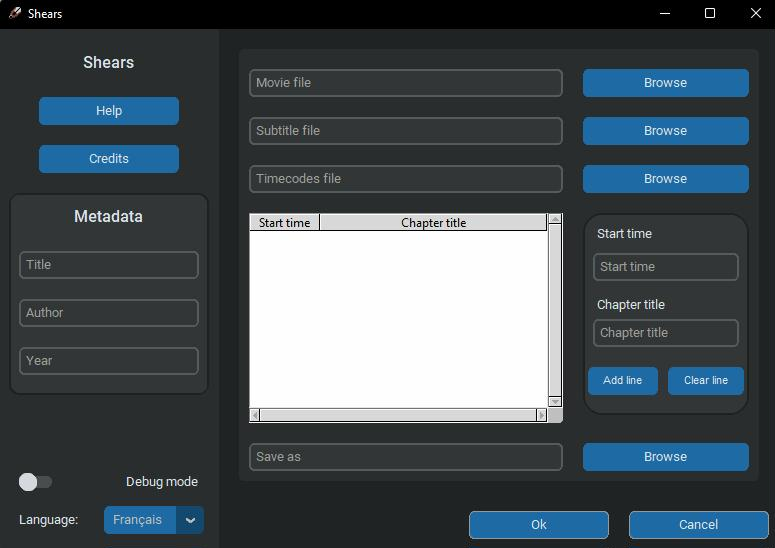

# Shear

Shears is a simple tool for adding chapters to a video file. It is designed to be used with [FFmpeg](https://ffmpeg.org/), and is written in Python 3.

  
| _The Shears interface_


## Installation
For Windows systems, download the latest release from the [releases page](). It is a portable executable.

For linux or MacOs systems, you will need to download the source code, and compile the executable with [auto-py-to-exe](https://pypi.org/project/auto-py-to-exe/). 

Dependencies are listed in `requirements.txt`.

> **Note that you will need to have [FFmpeg](https://ffmpeg.org/) installed on your system and added to your PATH for Shears to work.**

### Detailled installation
1. Download the latest release from the [releases page]().
2. Download the latest version of [FFmpeg](https://ffmpeg.org/download.html).
3. Extract the FFmpeg build to a folder.
4. Add the path to the FFmpeg executable to your PATH environment variable.
5. Extract the Shears release to a folder.
6. Install the dependencies with `pip install -r requirements.txt`.
7. Compile `Shears_UI.py` with `auto-py-to-exe` (see [this page](https://github.com/TomSchimansky/CustomTkinter/wiki/Packaging) for more details on how to compile an executable with `customtkinter`).

> Be sure to add the customtkinter and Ressources files to the additional files when compiling with `auto-py-to-exe`.

You can also compile the executable yourself with `pyinstaller`, with the following command (where `[.]` is the path to the Shears folder) :
```bash
pyinstaller --noconfirm --onefile --windowed --icon "[.]/Shears/Ressources/Shears_icon.ico" --name "Shears" --add-data "[.]/customtkinter;customtkinter/" --add-data "[.]/Shears/Ressources/Shears_icon.ico;Ressources/"  "[.]/Shears/Builds/Shears_UI.py"
```

## Documentation
Shears is designed to be used with [FFmpeg](https://ffmpeg.org/).

The video files used can be any format that FFmpeg supports. The output file will be of the same format as the input file.

The chapters file should be a text file, with each line containing the start time and end time of a chapter. The times should be in the format `HH:MM:SS` or `MM:SS`.

> You can use the *debug mode* button to see the command that will be executed by FFmpeg as well as some more error messages.


In the files, you will also find a `Shear.py` file. This is a Python script that can be used to add chapters to a video file. It is not recommended to use it, because it is not as user-friendly as the executable, but can be used with arguments. The syntax is as follows:

```console
Shear.py <input file> <chapters file> [-h] [-o <output file>] [-mt <movie title>] [-a <author>] [-y <year>]
```

> **Warning:** The chapters must be in order, because the python script will not sort them, and that will probably cause an error when adding the chapters to the video file.


## More to come !
I plan to add more features to Shear, such as:

- [ ] Adding a language support (currently only English is supported)
- [ ] Add an installer for [FFmpeg](https://ffmpeg.org/) for Windows systems
- [ ] Rework the python script to make it a little more user-friendly (Ordering the chapters, etc.)